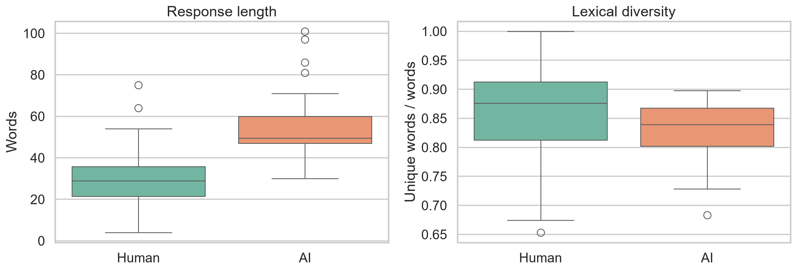
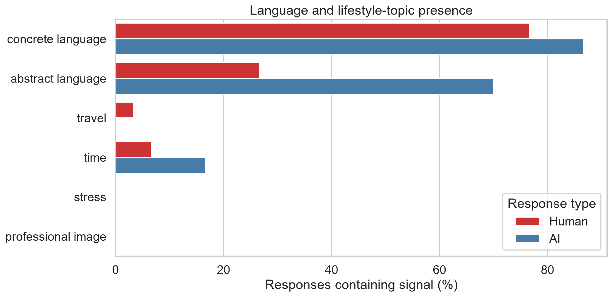
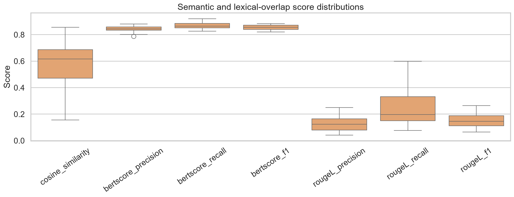
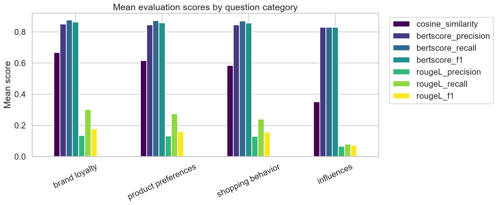
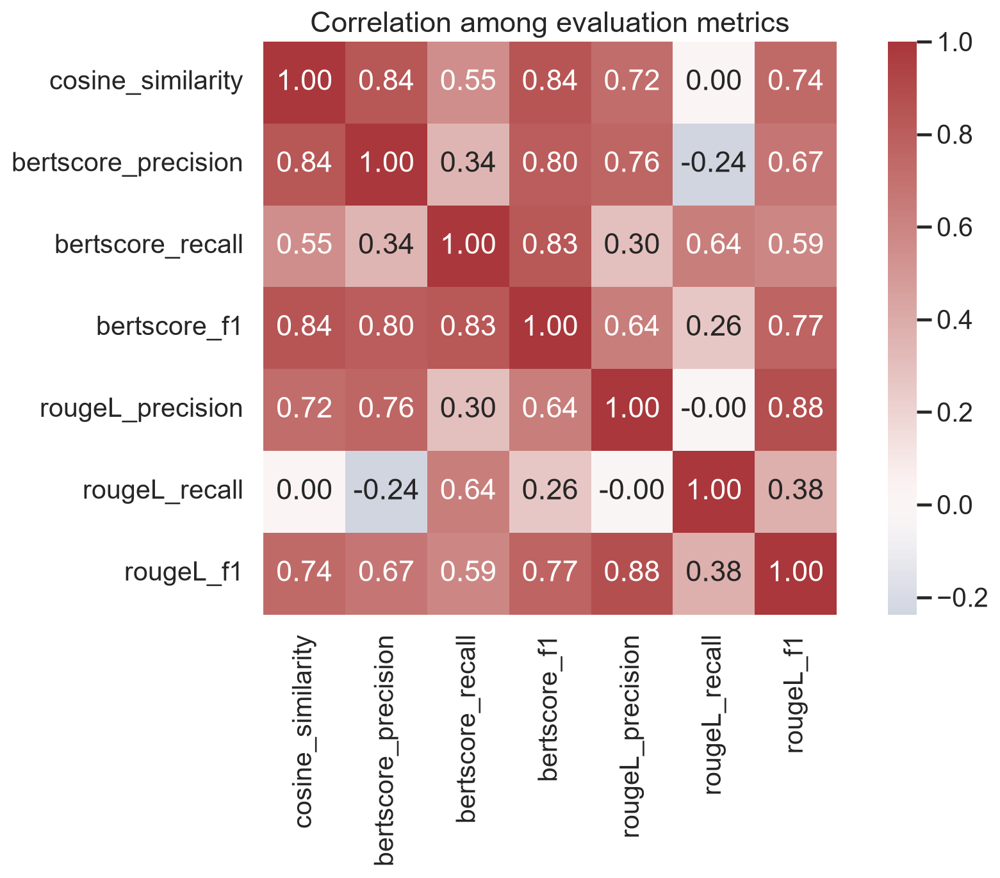

# Quantitative Analysis Report

## Executive Summary

This report combines the outputs of the preprocessing and semantic-analysis notebooks for 30 paired human/AI answers. The dataset has no missing values in the five cleaned fields. AI answers are substantially longer and contain more abstract-language indicators, while the semantic metrics show strong contextual similarity but comparatively low exact-sequence overlap.

The central result is that the metrics tell complementary stories:

- **Embedding cosine similarity**: mean `0.585`, median `0.617`.
- **BERTScore F1**: mean `0.856`, indicating high contextual token-level alignment.
- **ROUGE-L F1**: mean `0.153`, indicating limited shared ordered wording.

This pattern is consistent with AI answers generally addressing similar topics using more elaborated and differently worded responses.

## 1. Scope and Data

| Item | Value |
|---|---:|
| Source sheet | `answer_pairs` |
| Paired records | 30 |
| Human responses | 30 |
| AI responses | 30 |
| Question categories | 4 |

The paired table is in [`data/processed/paired_answers_clean.csv`](../data/processed/paired_answers_clean.csv). Row-level preprocessing features are in [`response_level_metrics.csv`](../data/processed/response_level_metrics.csv), and semantic scores are in [`semantic_similarity_scores.csv`](../data/processed/semantic_similarity_scores.csv).

## 2. Preprocessing and Text Characteristics

### 2.1 Response length and vocabulary

| Response type | Mean words | Median words | Min | Max | Mean lexical diversity | Mean concrete-term count | Mean abstract-term count |
|---|---:|---:|---:|---:|---:|---:|---:|
| Human | 31.2 | 29.0 | 4 | 75 | 0.859 | 2.0 | 0.367 |
| AI | 54.5 | 49.5 | 30 | 101 | 0.828 | 3.4 | 1.500 |

AI responses average **23.3 more words**, or approximately **75% longer** than human responses. Human responses have slightly higher lexical diversity, despite having lower absolute vocabulary counts, because they are shorter and less elaborated.



### 2.2 Language and lifestyle indicators

| Signal | Human | AI |
|---|---:|---:|
| Concrete language present | 76.7% | 86.7% |
| Abstract language present | 26.7% | 70.0% |
| Mentions travel | 3.3% | 0.0% |
| Mentions time | 6.7% | 16.7% |
| Mentions stress | 0.0% | 0.0% |
| Mentions professional image | 0.0% | 0.0% |

AI responses are more likely to include both tangible product references and abstract concepts such as convenience, reliability, value, and performance. The lifestyle-constraint indicators are sparse in this dataset, so zero detections for stress and professional image should not be interpreted as evidence that these topics are universally absent.



### 2.3 Missingness and artifacts

No missing values were found in `Person ID`, `Question Category`, `Question Text`, `Human Answer`, or `AI Answer`.

The quality screen identified 21 flags:

| Artifact | Count | Interpretation |
|---|---:|---|
| Non-ASCII characters | 15 | Mostly curly punctuation and emoji in AI responses |
| Unusually long human response | 2 | 64 and 75 words, above the human IQR threshold |
| Unusually long AI response | 4 | 81, 86, 97, and 101 words, above the AI IQR threshold |

These are review candidates rather than automatic errors. Normalization collapsed whitespace in the clean table but preserved the original workbook values.

## 3. Semantic and Lexical Similarity

### 3.1 Overall scores

| Metric | Mean | Standard deviation | Median | Minimum | Maximum |
|---|---:|---:|---:|---:|---:|
| Cosine similarity | 0.585 | 0.181 | 0.617 | 0.157 | 0.856 |
| BERTScore precision | 0.844 | 0.020 | 0.845 | 0.788 | 0.881 |
| BERTScore recall | 0.868 | 0.024 | 0.866 | 0.828 | 0.921 |
| BERTScore F1 | 0.856 | 0.018 | 0.856 | 0.821 | 0.884 |
| ROUGE-L precision | 0.126 | 0.051 | 0.125 | 0.042 | 0.250 |
| ROUGE-L recall | 0.248 | 0.141 | 0.198 | 0.077 | 0.600 |
| ROUGE-L F1 | 0.153 | 0.055 | 0.147 | 0.066 | 0.265 |



Cosine similarity and BERTScore indicate that the paired answers are generally related in meaning. ROUGE-L is much lower because the AI answers commonly expand, paraphrase, or reorganize the human answer rather than reuse the same word sequence. BERTScore recall is higher than precision on average, which is compatible with longer AI answers covering much of the human answer's contextual content while adding additional material.

### 3.2 Category-level means

| Question category | Pairs | Cosine | BERTScore F1 | ROUGE-L F1 |
|---|---:|---:|---:|---:|
| Brand loyalty | 3 | 0.668 | 0.863 | 0.177 |
| Influences | 3 | 0.351 | 0.830 | 0.072 |
| Product preferences | 15 | 0.616 | 0.858 | 0.161 |
| Shopping behavior | 9 | 0.585 | 0.857 | 0.157 |

The **influences** category has the lowest scores across all three headline metrics. **Brand loyalty** has the highest mean cosine similarity and ROUGE-L F1, although it contains only three pairs. Product preferences has the largest sample and sits close to the overall average.



### 3.3 Metric agreement

The following Pearson correlations show that the metrics overlap but are not interchangeable:

|  | Cosine | BERT P | BERT R | BERT F1 | ROUGE P | ROUGE R | ROUGE F1 |
|---|---:|---:|---:|---:|---:|---:|---:|
| Cosine | 1.00 | 0.84 | 0.55 | 0.84 | 0.72 | 0.00 | 0.74 |
| BERT P | 0.84 | 1.00 | 0.34 | 0.80 | 0.76 | -0.24 | 0.67 |
| BERT R | 0.55 | 0.34 | 1.00 | 0.83 | 0.30 | 0.64 | 0.59 |
| BERT F1 | 0.84 | 0.80 | 0.83 | 1.00 | 0.64 | 0.26 | 0.77 |
| ROUGE P | 0.72 | 0.76 | 0.30 | 0.64 | 1.00 | 0.00 | 0.88 |
| ROUGE R | 0.00 | -0.24 | 0.64 | 0.26 | 0.00 | 1.00 | 0.38 |
| ROUGE F1 | 0.74 | 0.67 | 0.59 | 0.77 | 0.88 | 0.38 | 1.00 |



Cosine similarity and BERTScore F1 correlate strongly at `r = 0.84`, while ROUGE-L recall is nearly independent of cosine similarity (`r = 0.00`). This supports retaining all metric families: semantic relatedness, contextual alignment, and ordered word overlap capture different dimensions.

## 4. Pair-Level Review

### Lowest cosine-similarity pairs

| Row | Person ID | Category | Cosine | BERTScore F1 | ROUGE-L F1 |
|---:|---|---|---:|---:|---:|
| 29 | c_human | Shopping behavior | 0.157 | 0.821 | 0.089 |
| 15 | s_human | Influences | 0.217 | 0.827 | 0.072 |
| 23 | c_human | Product preferences | 0.243 | 0.838 | 0.078 |

These pairs have relatively low embedding similarity despite moderate BERTScore values. They are good candidates for qualitative review because the AI may preserve broad contextual elements while shifting emphasis or adding generic content.

### Highest cosine-similarity pairs

| Row | Person ID | Category | Cosine | BERTScore F1 | ROUGE-L F1 |
|---:|---|---|---:|---:|---:|
| 6 | s_human | Product preferences | 0.856 | 0.884 | 0.265 |
| 3 | s_human | Shopping behavior | 0.820 | 0.874 | 0.151 |
| 18 | s_human | Product preferences | 0.810 | 0.871 | 0.214 |

High semantic similarity does not necessarily mean the answers are equivalent in wording or detail. For example, the highest cosine pair still has only moderate ROUGE-L F1.

## 5. Conclusions and Recommended Next Analyses

1. AI answers are longer and more abstract than human answers, suggesting elaboration and generalization beyond the original response style.
2. The high BERTScore values and moderate cosine scores indicate substantial contextual alignment across most pairs.
3. Low ROUGE-L values show that alignment is usually paraphrastic rather than verbatim.
4. The influences category warrants targeted qualitative review because it has the lowest average alignment across all headline metrics.
5. Category-level comparisons should remain descriptive: the sample is small and unevenly distributed, especially for brand loyalty and influences, with three pairs each.
6. Future evaluation should combine these automatic metrics with human judgments of relevance, factual faithfulness, completeness, and whether the AI introduces unsupported claims.

## Reproducibility

Figures were generated from the processed CSVs with:

```powershell
& ".venv\Scripts\python.exe" "reports\generate_report_figures.py"
```

The notebooks that produced and explore the underlying outputs are:

- [`preprocessed_pipeline_analysis.ipynb`](../notebooks/preprocessed_pipeline_analysis.ipynb)
- [`semantic_similarity_analysis.ipynb`](../notebooks/semantic_similarity_analysis.ipynb)
